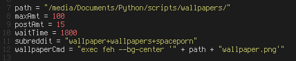

<h1>Set Up</h1>
<strong>This script (<em>wallpaper.py</em>) uses <a href="https://praw.readthedocs.org/">PRAW</a> (you'll need it installed).</strong> 
*The optional size.py script uses <a href="https://pillow.readthedocs.org/">Pillow</a>.* 
At the beginning of the script, you should find the following right underneath the imports: 
 
<strong>path</strong> - the full path to the location to save/keep the wallpapers. 
<strong>maxAmt</strong> - the max amount of wallpapers to keep saved. 
<strong>postAmt</strong> - the amount of top posts (wallpapers) to save each time the script downloads wallpapers. 
<strong>waitTime</strong> - the amount of time in seconds to wait to update wallpapers. Default is 30 mins. 
<strong>subreddit</strong> - the subreddit(s) to download from. Seperate multiple subreddits by using a '+'. 
<strong>wallpaperCmd</strong> - the system command used to change wallpapers. Default assumes you are using feh to set your wallpaper. 
 
Just change these to however you see fit. 

Run this script just as you would any python script, by using the following command: 
<em>python wallpaper.py &</em> 
(assuming you are in the directory that contains wallpaper.py) 
The '&' will run it in the background.

<h1>Tips</h1>
Run this script at start-up. 
Running <em>python wallpaper.py reload</em> will change the current wallpaper manually. 
You should bind this command to allow for even easier changing of wallpapers (I have it binded to SUPER+CTRL+SHIFT+R). 
If you're using this on Windows, you can set <strong>wallpaperCmd</strong> to an empty string ("") and just point Windows to the directory. 
You can run size.py to delete broken images and images that aren't the desired resolution. 
